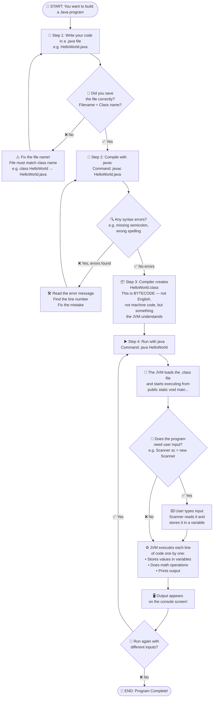
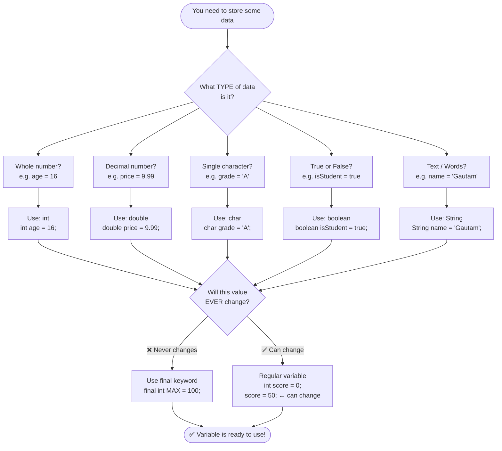
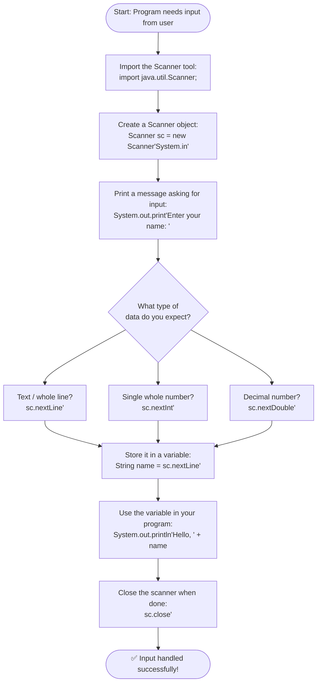

# 🔵 Flowchart — How Java Works (Chapter 1: Foundations)

> **Goal:** Understand the complete journey from writing Java code to seeing output on your screen — explained step by step, like a GPS route.

---

## 🗺️ Main Flowchart: The Full Java Journey

---

## 📦 Flowchart 2: Understanding Variables

---

## 🔤 Flowchart 3: Reading User Input with Scanner

---

## 🎯 Key Concepts Illustrated in These Flowcharts

| Symbol | Meaning |
|--------|---------|
| ⬭ Oval | Start or End of the process |
| ▭ Rectangle | An action or step |
| ◇ Diamond | A decision (Yes/No question) |
| → Arrow | The flow of execution |

### The 3 Golden Rules of Chapter 1:
1. **File name = Class name** (HelloWorld.java → `class HelloWorld`)
2. **Always compile before running** (`javac` first, then `java`)
3. **Every statement ends with a semicolon** `;`
