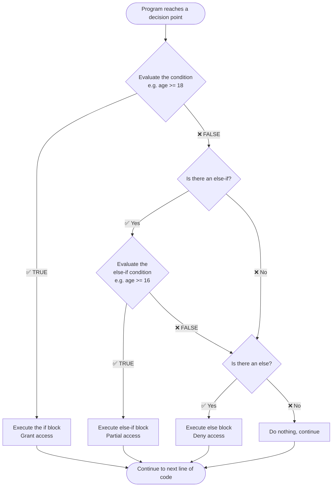
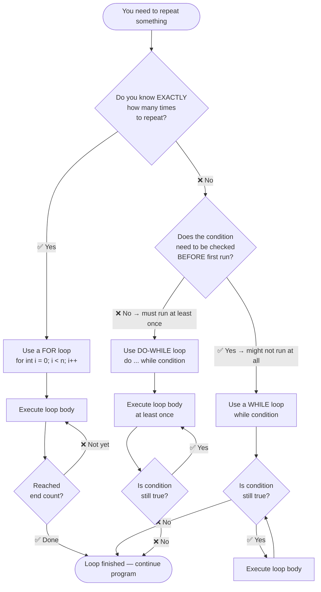
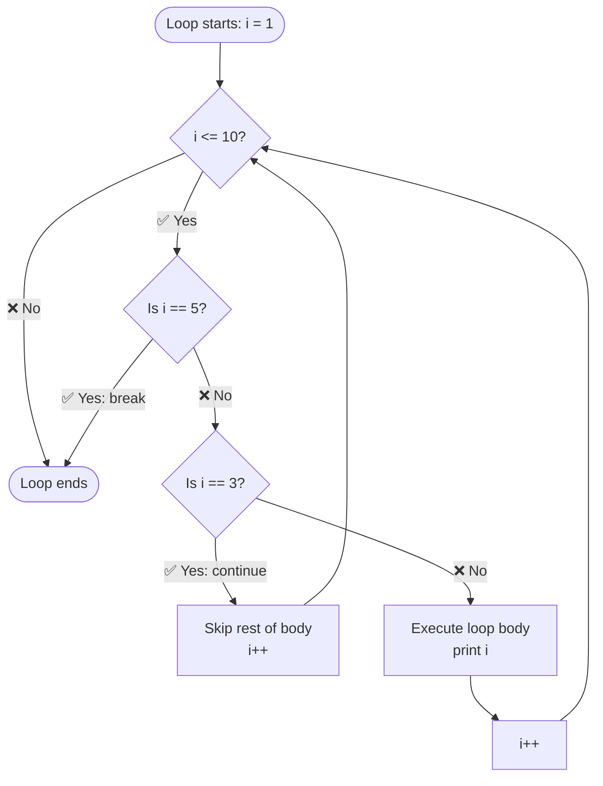
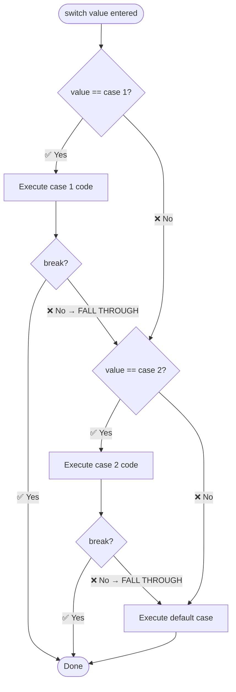

# 🔵 Flowchart — How Control Flow Works (Chapter 2)

---

## 🗺️ Main Flowchart: if-else Decision Tree

---

## 🗺️ Flowchart 2: Choosing the Right Loop

---

## 🗺️ Flowchart 3: break vs continue

> **Result of this loop:** Prints 1, 2, 4 (skips 3 because of continue, stops before 5 because of break)

---

## 🗺️ Flowchart 4: switch Statement

> ⚠️ **Fall-through warning:** If you forget `break`, Java will run the NEXT case too! Always use `break` unless you explicitly want fall-through.
