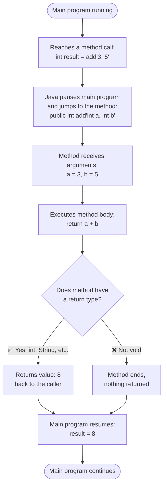
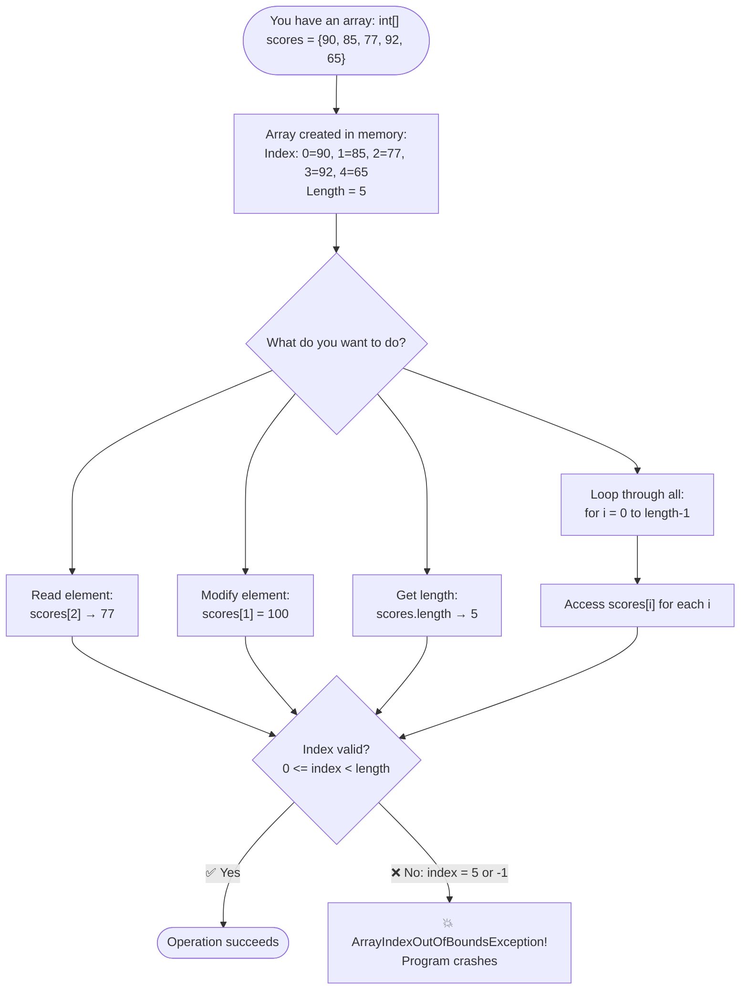
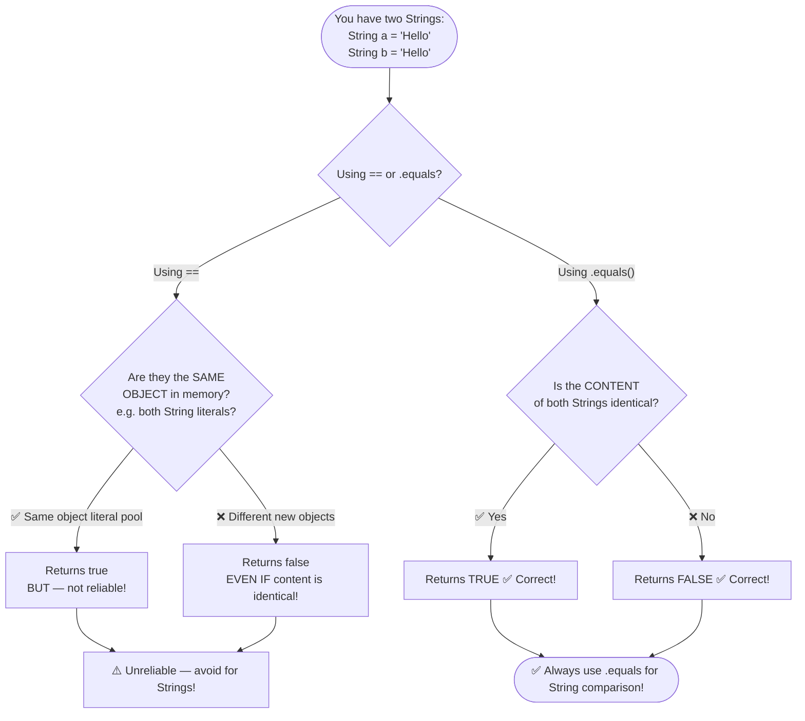

# 🔵 Flowchart — Methods, Arrays & Strings (Chapter 3)

---

## Flowchart 1: How a Method Works

---

## Flowchart 2: Accessing Array Elements

---

## Flowchart 3: String Comparison — The equals() vs == Trap

---

## Key Rules Summary

| Concept | Rule |
|---------|------|
| Array index | Always starts at **0**, ends at **length - 1** |
| Method void | Means "returns nothing" |
| String comparison | ALWAYS use `.equals()`, never `==` |
| 2D array access | `array[row][col]` — row first, column second |
