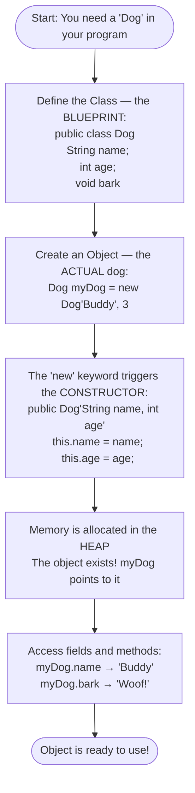
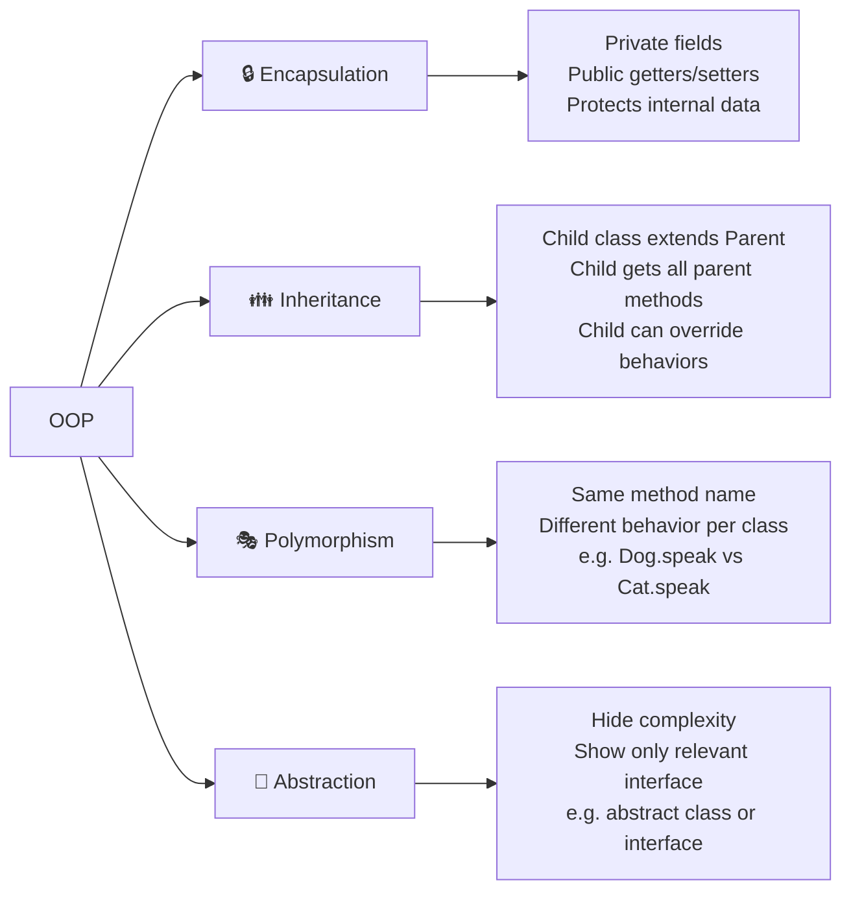
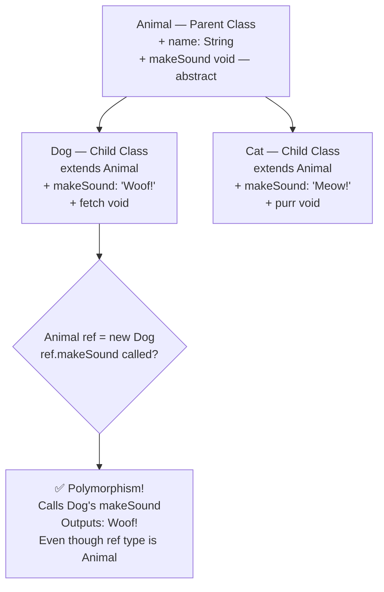
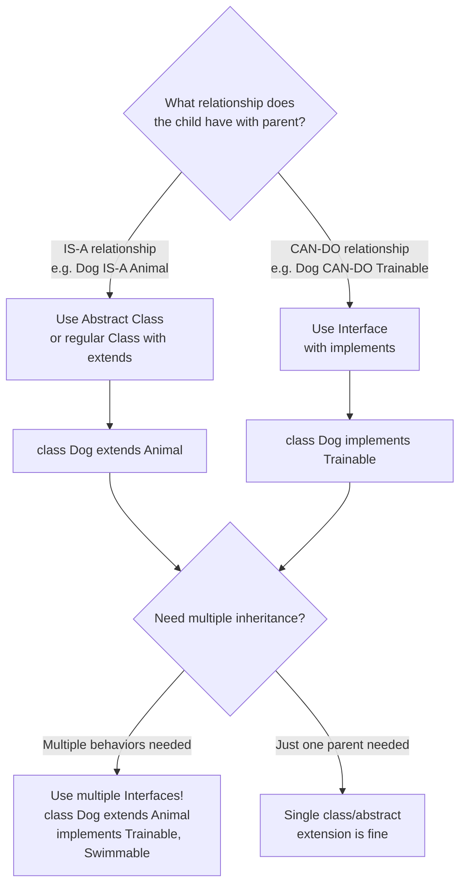

# 🔵 Flowchart — How OOP Works (Chapter 4)

---

## Flowchart 1: Class → Object Creation

---

## Flowchart 2: The 4 Pillars of OOP

---

## Flowchart 3: Inheritance Chain

---

## Flowchart 4: Interface vs Abstract Class — Which to Use?

