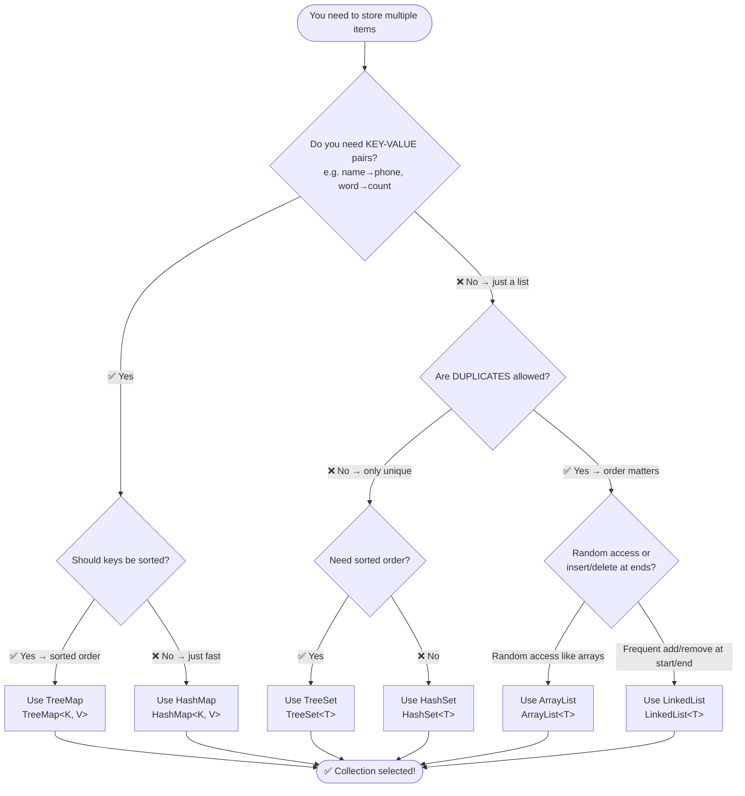
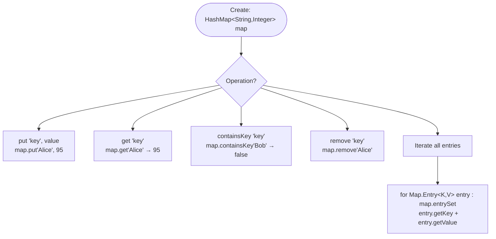

# 🔵 Flowchart — Collections Framework (Chapter 5)

## Flowchart 1: Choosing the Right Collection

```mermaid
flowchart TD
    A([You need to store multiple items]) --> B

    B{Do you need KEY-VALUE pairs?\ne.g. name→phone, word→count}

    B -- ✅ Yes --> C{Should keys be sorted?}
    C -- ✅ Yes → sorted order --> D[Use TreeMap\nTreeMap&lt;K, V&gt;]
    C -- ❌ No → just fast --> E[Use HashMap\nHashMap&lt;K, V&gt;]

    B -- ❌ No → just a list --> F{Are DUPLICATES allowed?}

    F -- ❌ No → only unique --> G{Need sorted order?}
    G -- ✅ Yes --> H[Use TreeSet\nTreeSet&lt;T&gt;]
    G -- ❌ No --> I[Use HashSet\nHashSet&lt;T&gt;]

    F -- ✅ Yes → order matters --> J{Random access or\ninsert/delete at ends?}
    J -- Random access like arrays --> K[Use ArrayList\nArrayList&lt;T&gt;]
    J -- Frequent add/remove at start/end --> L[Use LinkedList\nLinkedList&lt;T&gt;]

    D & E & H & I & K & L --> M([✅ Collection selected!])
```

## Flowchart 2: HashMap Operations

```mermaid
flowchart TD
    A([Create: HashMap&lt;String,Integer&gt; map]) --> B

    B{Operation?}

    B --> C[put 'key', value\nmap.put'Alice', 95]
    B --> D[get 'key'\nmap.get'Alice' → 95]
    B --> E[containsKey 'key'\nmap.containsKey'Bob' → false]
    B --> F[remove 'key'\nmap.remove'Alice']
    B --> G[Iterate all entries]

    G --> H[for Map.Entry&lt;K,V&gt; entry : map.entrySet\n  entry.getKey + entry.getValue]
```
