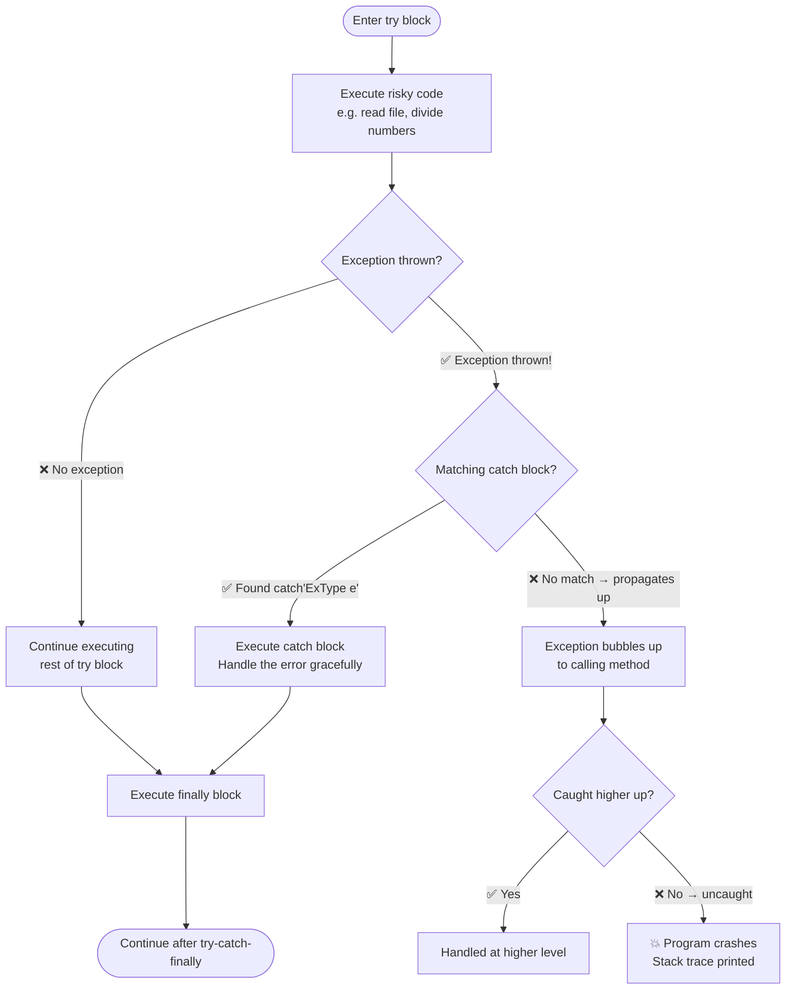
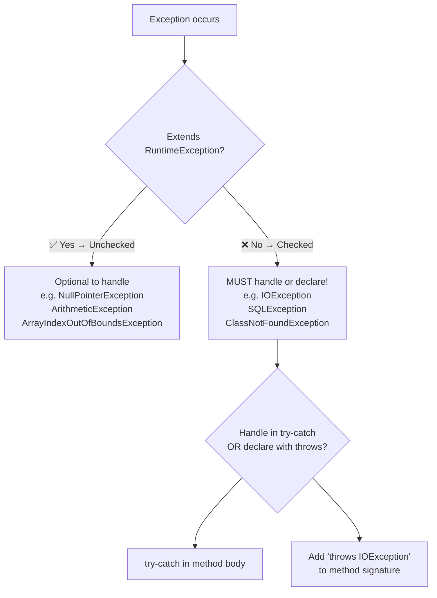

# 🔵 Flowchart — Exception Handling (Chapter 6)

## Flowchart 1: try-catch-finally Execution

```mermaid
flowchart TD
    A([Enter try block]) --> B

    B[Execute risky code\ne.g. read file, divide numbers]

    B --> C{Exception thrown?}

    C -- ❌ No exception --> D[Continue executing\nrest of try block]
    D --> F[Execute finally block]

    C -- ✅ Exception thrown! --> E{Matching catch block?}

    E -- ✅ Found catch'ExType e' --> G[Execute catch block\nHandle the error gracefully]
    G --> F

    E -- ❌ No match → propagates up --> H[Exception bubbles up\nto calling method]
    H --> I{Caught higher up?}
    I -- ✅ Yes --> J[Handled at higher level]
    I -- ❌ No → uncaught --> K[💥 Program crashes\nStack trace printed]

    F --> L([Continue after try-catch-finally])
```

## Flowchart 2: Checked vs Unchecked

```mermaid
flowchart TD
    A[Exception occurs] --> B{Extends RuntimeException?}
    B -- ✅ Yes → Unchecked --> C[Optional to handle\ne.g. NullPointerException\nArithmeticException\nArrayIndexOutOfBoundsException]
    B -- ❌ No → Checked --> D[MUST handle or declare!\ne.g. IOException\nSQLException\nClassNotFoundException]
    D --> E{Handle in try-catch\nOR declare with throws?}
    E --> F[try-catch in method body]
    E --> G[Add 'throws IOException'\nto method signature]
```
