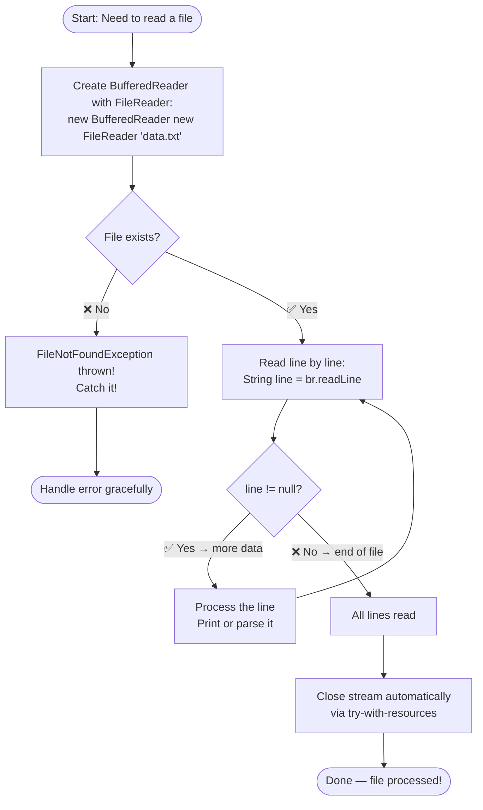
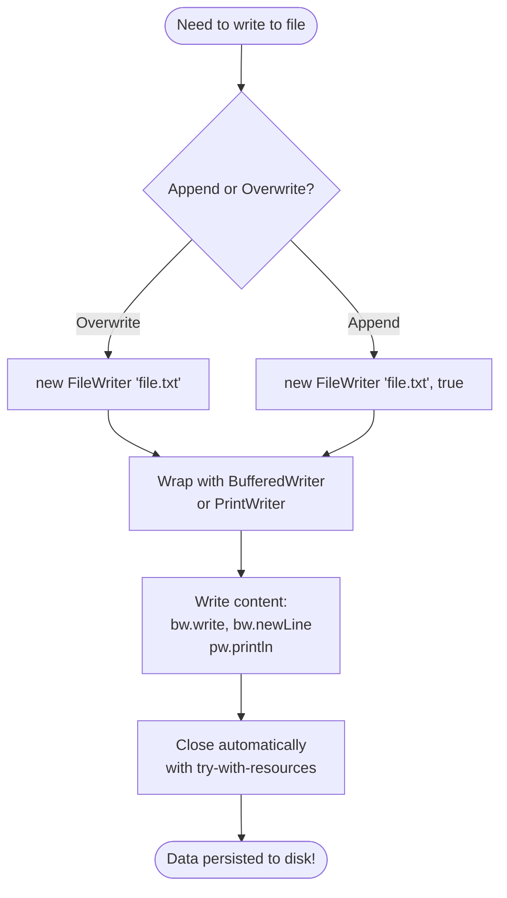

# 🔵 Flowchart — File I/O (Chapter 7)

## Flowchart: File Reading Process

```mermaid
flowchart TD
    A([Start: Need to read a file]) --> B
    B[Create BufferedReader with FileReader:\nnew BufferedReader new FileReader 'data.txt']
    B --> C{File exists?}
    C -- ❌ No --> D[FileNotFoundException thrown!\nCatch it!]
    C -- ✅ Yes --> E[Read line by line:\nString line = br.readLine]
    E --> F{line != null?}
    F -- ✅ Yes → more data --> G[Process the line\nPrint or parse it]
    G --> E
    F -- ❌ No → end of file --> H[All lines read]
    H --> I[Close stream automatically\nvia try-with-resources]
    I --> J([Done — file processed!])
    D --> K([Handle error gracefully])
```

## Flowchart: Writing to a File

```mermaid
flowchart TD
    A([Need to write to file]) --> B
    B{Append or Overwrite?}
    B -- Overwrite --> C[new FileWriter 'file.txt']
    B -- Append --> D[new FileWriter 'file.txt', true]
    C & D --> E[Wrap with BufferedWriter\nor PrintWriter]
    E --> F[Write content:\nbw.write, bw.newLine\npw.println]
    F --> G[Close automatically\nwith try-with-resources]
    G --> H([Data persisted to disk!])
```
