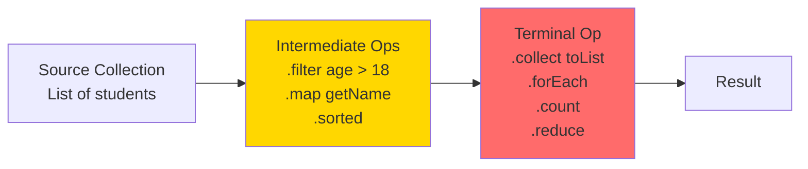
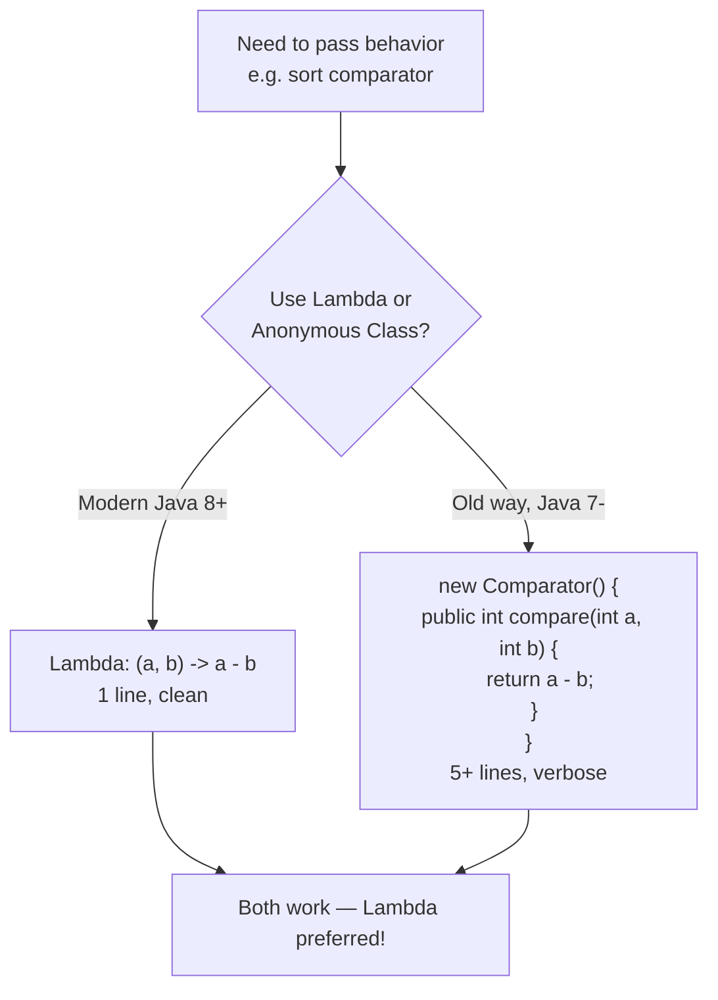

# 🔵 Flowchart — Generics & Functional Programming (Chapter 8)

## Flowchart 1: Stream Pipeline

```mermaid
flowchart LR
    A[Source Collection\nList of students] --> B
    B[Intermediate Ops\n.filter age > 18\n.map getName\n.sorted] --> C
    C[Terminal Op\n.collect toList\n.forEach\n.count\n.reduce]
    C --> D[Result]

    style B fill:#ffd700
    style C fill:#ff6b6b
```

## Flowchart 2: Lambda vs Anonymous Class

```mermaid
flowchart TD
    A[Need to pass behavior\ne.g. sort comparator] --> B
    B{Use Lambda or\nAnonymous Class?}
    B -- Modern Java 8+ --> C["Lambda: (a, b) -> a - b\n1 line, clean"]
    B -- Old way, Java 7- --> D["new Comparator<Integer>() {\n  public int compare(int a, int b) {\n    return a - b;\n  }\n}\n5+ lines, verbose"]
    C & D --> E[Both work — Lambda preferred!]
```
