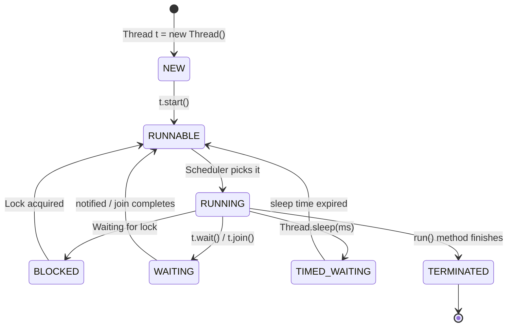
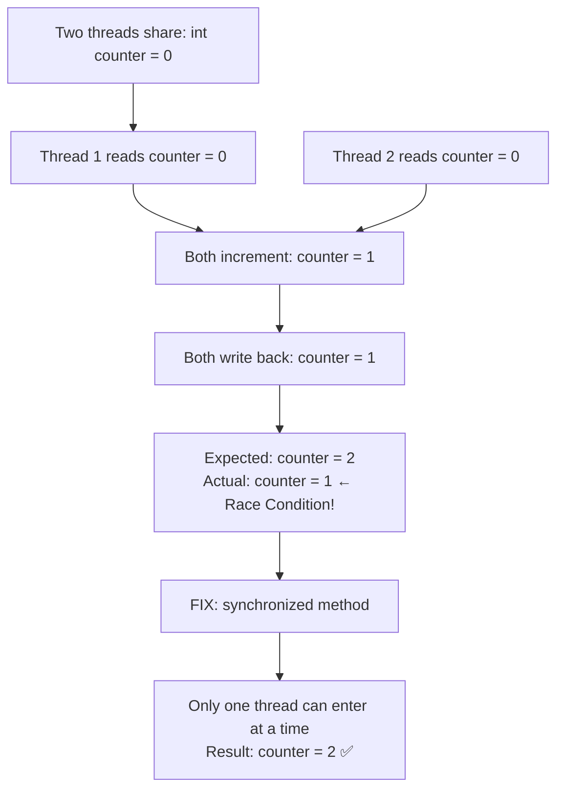

# 🔵 Flowchart — Multithreading (Chapter 9)

## Flowchart 1: Thread Lifecycle

```mermaid
stateDiagram-v2
    [*] --> NEW : Thread t = new Thread()
    NEW --> RUNNABLE : t.start()
    RUNNABLE --> RUNNING : Scheduler picks it
    RUNNING --> BLOCKED : Waiting for lock
    RUNNING --> WAITING : t.wait() / t.join()
    RUNNING --> TIMED_WAITING : Thread.sleep(ms)
    BLOCKED --> RUNNABLE : Lock acquired
    WAITING --> RUNNABLE : notified / join completes
    TIMED_WAITING --> RUNNABLE : sleep time expired
    RUNNING --> TERMINATED : run() method finishes
    TERMINATED --> [*]
```

## Flowchart 2: Race Condition & Fix

```mermaid
flowchart TD
    A[Two threads share: int counter = 0] --> B

    B[Thread 1 reads counter = 0] --> C
    B2[Thread 2 reads counter = 0] --> C

    C[Both increment: counter = 1]
    C --> D[Both write back: counter = 1]
    D --> E[Expected: counter = 2\nActual: counter = 1 ← Race Condition!]

    E --> F[FIX: synchronized method]
    F --> G[Only one thread can enter at a time\nResult: counter = 2 ✅]
```
