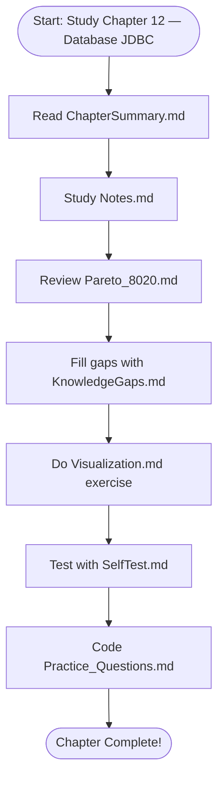

# 🔵 Flowchart — Chapter 12 — Database JDBC

> Detailed flowcharts for this chapter are included in the Notes.md file.
> Refer to the conceptual diagrams while reading through the chapter notes.

## Process Overview

