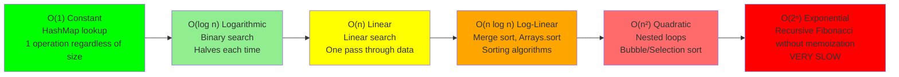
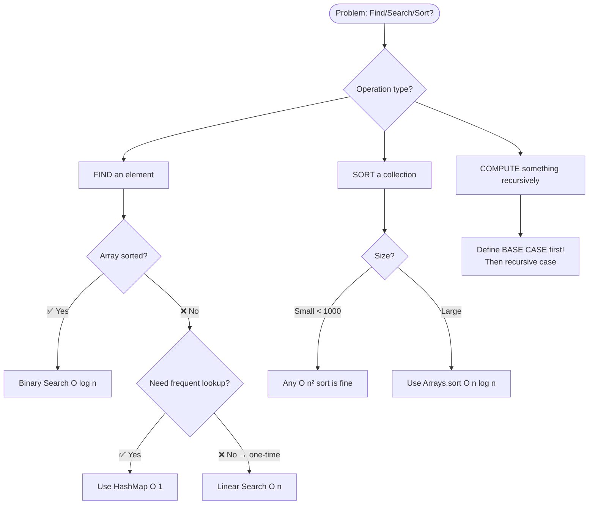

# 🔵 Flowchart — DSA (Chapter 16)

## Flowchart 1: Big-O Complexity — Which is Fastest?



## Flowchart 2: Binary Search

```mermaid
flowchart TD
    A([Array must be SORTED first!]) --> B
    B[Set left=0, right=arr.length-1] --> C
    C{left <= right?}
    C -- ❌ No --> D[Target NOT found → return -1]
    C -- ✅ Yes --> E[mid = left + right / 2]
    E --> F{arr[mid] == target?}
    F -- ✅ Yes --> G[Return mid index ← Found!]
    F -- ❌ arr[mid] < target --> H[Search RIGHT half: left = mid + 1]
    F -- ❌ arr[mid] > target --> I[Search LEFT half: right = mid - 1]
    H & I --> C
```

## Flowchart 3: Choosing an Algorithm


