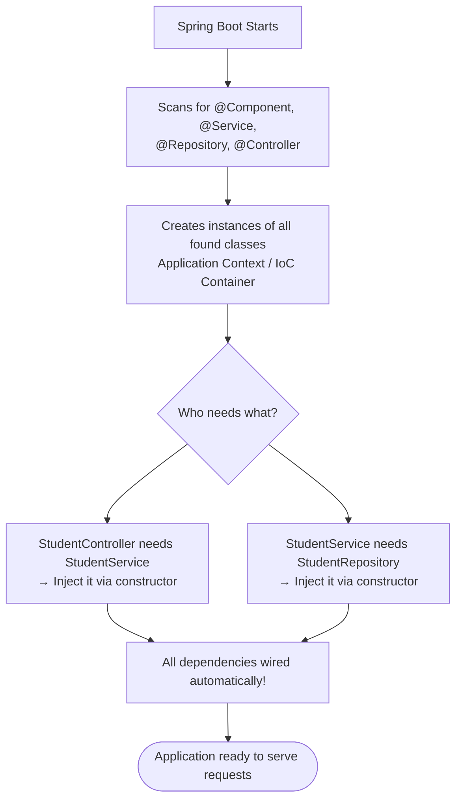

# 🔵 Flowchart — Spring Boot Request Flow (Chapter 21)

## Flowchart 1: HTTP Request Flow in Spring Boot

```mermaid
flowchart TD
    A([Client Browser/Postman\nHTTP GET /api/students]) --> B

    B[Spring's DispatcherServlet\nroutes the request]

    B --> C[@RestController\nStudentController\nGET /api/students]

    C --> D[Calls @Service\nStudentService.getAllStudents]

    D --> E[Calls @Repository\nStudentRepository.findAll]

    E --> F[Database Query\nSELECT * FROM students]

    F --> E
    E --> D
    D --> C

    C --> G[Returns List<Student> as JSON]

    G --> A2[Client receives JSON response\n200 OK]
```

## Flowchart 2: Dependency Injection


