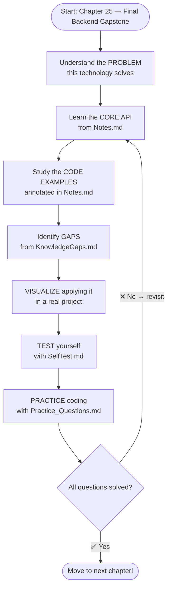

# 🔵 Flowchart — Chapter 25 — Final Backend Capstone

## Learning Path for This Chapter

```mermaid
flowchart TD
    A([Start: Chapter 25 — Final Backend Capstone]) --> B[Understand the PROBLEM\nthis technology solves]
    B --> C[Learn the CORE API\nfrom Notes.md]
    C --> D[Study the CODE EXAMPLES\nannotated in Notes.md]
    D --> E[Identify GAPS\nfrom KnowledgeGaps.md]
    E --> F[VISUALIZE applying it\nin a real project]
    F --> G[TEST yourself\nwith SelfTest.md]
    G --> H[PRACTICE coding\nwith Practice_Questions.md]
    H --> I{All questions solved?}
    I -- ❌ No → revisit --> C
    I -- ✅ Yes --> J([Move to next chapter!])
```

## Concept Relationship Map
See Notes.md for detailed diagrams specific to this chapter's technology.
